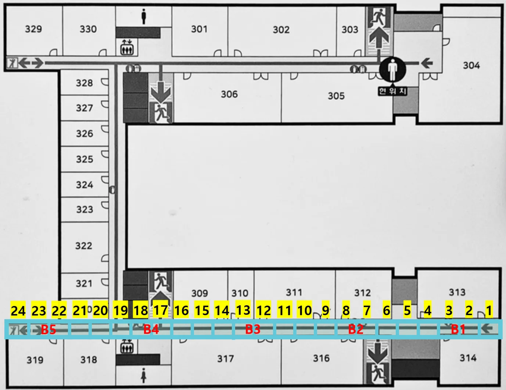

# ConfMaskFormer
#### 신호 결측에 강건한 비컨 기반 실내 위치 추정 딥러닝 모델

## 데이터 수집 환경
- 장소: 인천대학교 정보기술대학 7호관 3층
- 구조: 직선형 복도(길이 70.6m, 폭 2.5m, 천장 높이 3.3m)
- 위치: 3m 간격의 24개 구역
- 비컨: 15m 간격의 5개 천장 설치
- 수집 방법: 각 위치 내에서 연속적으로 이동하며 데이터 수집
  



## 데이터 형태
- 각 위치마다 776개, 총 18,624개 데이터 확보
- -infinity는 수신되지 않은 신호로 0으로 대체하여 활용
  
|     B1    |     B2    |     B3    |     B4    |     B5    | Zone |
| :-------: | :-------: | :-------: | :-------: | :-------: | :--: |
| -infinity | -infinity | -infinity | -infinity |    -88    |   1  |
| -infinity |    -83    | -infinity |    -86    | -infinity |   1  |
| -infinity | -infinity |    -84    |    -86    | -infinity |   1  |
| -infinity |    -84    |    -90    |    -88    | -infinity |   1  |
|    -70    | -infinity | -infinity | -infinity | -infinity |   1  |


## 데이터 전처리(data_split.py)
BLE RSSI 시계열 CSV를 대상으로 5-fold 스플릿 → Min-Max 정규화(0=결측 보존) → 슬라이딩 윈도우 → .csv/.npz 저장
#### 입출력 개요
입력: ```./data/in-motion/*.csv```
출력
- 분할된 원본/정규화 CSV
     ```./data/data_split/{raw|norm}/<dataset>/<split>/<phase>/*.csv```
- 슬라이딩 윈도우 NPZ
     ```./data/data_split/npz/<dataset>/{train|test}_{split}.npz```
- ```<dataset>```: 입력 폴더명(in-motion), ```<split>```: pos_0~pos_4, ```<phase>```: train|test
#### 폴더 구조 예시
```text
data/
└─ in-motion/
   ├─ 1.csv
   ├─ 2.csv
   └─ ...
data/data_split/
├─ raw/
│  └─ in-motion/pos_0/{train,test}/*.csv
├─ norm/
│  └─ in-motion/pos_0/{train,test}/*.csv
└─ npz/
   └─ in-motion/
      ├─ train_pos_0.npz
      ├─ test_pos_0.npz
      └─ ...
```
#### 파이프라인
1. K-fold
   - 각 CSV 길이를 L이라 할 때, 동일 길이로 5등분(≈L/5)
   - pos_k (k=0..4) 스플릿에서 k번째 구간을 test, 나머지를 train으로 사용
   - test 구간이 맨 앞/맨 뒤면 train은 연속 구간 하나로 저장, 중간이면 train을 두 조각(train_0, train_1) 으로 분리 저장
2. 정규화 통계
   - 모든 train 구간의 0을 제외한 RSSI만 모아 global min/max 계산(누수 방지)
   - 값 0은 결측으로 간주하고 통계에서 제외
3. 슬라이딩 윈도우 & NPZ
   - 정규화 CSV에서 윈도우 생성 → ```(N, window, (#beacons+1))``` 배열로 단일 NPZ 저장, 마지막 열은 Zone

#### 실행 방법
```python
python data_split.py
```
로그 예시
```bash
📁 Dataset: in-motion / Split pos_0
    ▪ Global Min (RSSI): -92.0
    ▪ Global Max (RSSI): -41.0
Sliding window: in-motion/pos_0/train: 100%|████| ...
✅ Saved ./data/data_split/npz/in-motion/train_pos_0.npz : 12345 samples
Sliding window: in-motion/pos_0/test:  100%|████| ...
✅ Saved ./data/data_split/npz/in-motion/test_pos_0.npz  :  2345 samples
```

## ConfMaskFormer Parameter
```python
class Cfg:
    window_size     = 10
    embedding_dim   = 96
    n_heads         = 8
    n_layers        = 2
    dropout         = 0.3
    lr              = 1e-3
    weight_decay    = 1e-3
    batch_size      = 256
    epochs          = 100
    alpha_neighbor  = 0.20
    aux_mask_ratio  = 0.30
    aux_loss_weight = 0.40
    beacon_dropout_p= 0.30
    num_workers     = 0
    seed            = 42
```

## Transformer Parameter
```python
class Config:
    def __init__(self):
        self.window_size = 10
        self.embedding_dim = 32
        self.n_heads = 8
        self.n_layers = 2
        self.dropout = 0.5
        self.n_beacons = 5
        self.n_classes = 24
        self.batch_size = 256
        self.num_epochs = 300
        self.lr = 1e-3
        self.device = 'cuda' if torch.cuda.is_available() else 'cpu'
        self.seed = 42
```

## Random Forest Parameter
```python
param_dict = {'max_depth': None, 'min_samples_leaf': 1, 'min_samples_split': 5, 'n_estimators': 300}
```

## XGBoost Parameter
```python
param = {'n_estimators': 300, 'max_depth': 5, 'learning_rate': 0.1, 'subsample': 0.8, 'colsample_bytree': 0.7}
```

##### 각 코드는 해당 폴더에서 ```python main.py```로 실행
